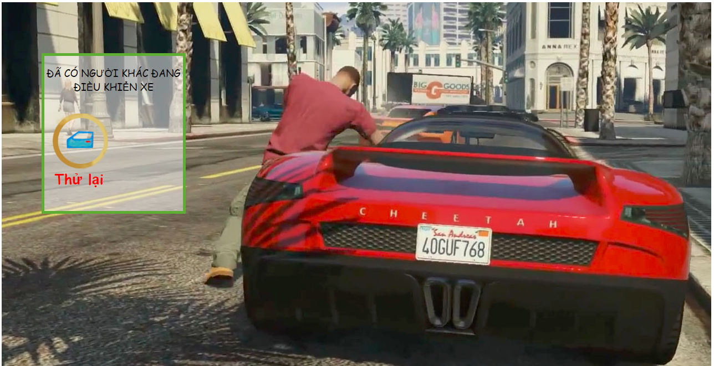

# RC car powered by ESP8266
## Overview
This project is used to remotely control a toy car using wifi radio and web interface of ESP8266.
## Features
- Control limit by one session at same time.
- Use websocket protocol to send control command.
- You can intergrate with arduino uno to add feature like self controlling.
## Installation
1. Change configurations in config.h
2. Upload static files in data folder to SPIFFS. *References:* [[1]](https://tttapa.github.io/ESP8266/Chap11%20-%20SPIFFS.html), [[2]](https://www.instructables.com/id/Using-ESP8266-SPIFFS/)
## Screenshots  

